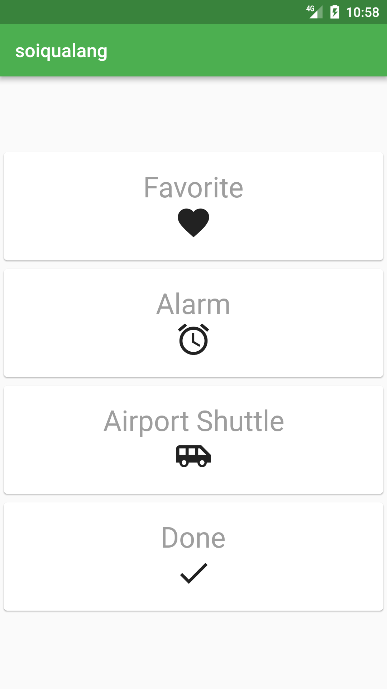
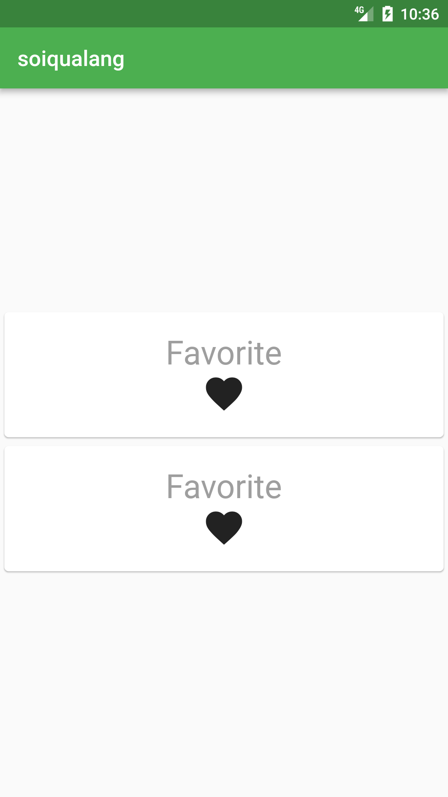

# a3_flutter_app_stateless

a3_flutter_app_stateless_widgets

## main_stateless_function.dart

**Create a reusable function make new card**

```dart
//Create a reusable make new card
class newcard extends StatelessWidget{
  final Widget title;
  final Widget icon;

  // Constructor. {} here denote that they are optional values i.e you can use as: new newcard()
  newcard(this.title,this.icon);

  @override
  Widget build(BuildContext context) {
    Container container=new Container(
      padding: const EdgeInsets.only(bottom: 1),
      child: new Card(
        child: new Container(
          padding: const EdgeInsets.all(20),
          child: new Column(
            children: <Widget>[
              this.title,
              this.icon,
            ],
          ),
        ),
      ),
    );
    return container;
  }
}
```

**Call function**

```dart
new newcard(new Text("Favorite",style: txtstyle), new Icon(Icons.favorite,size: iconsize,))
```



## main_manual.dart

Add card manually

```dart
Column col=new Column(
  //Stretch column full width
  crossAxisAlignment: CrossAxisAlignment.stretch,
  children: <Widget>[
	new Card(
	  child: new Container(
		padding: const EdgeInsets.all(20),
		child: new Column(
		  children: <Widget>[
			new Text("Favorite",style: txtstyle),
			new Icon(Icons.favorite,size: iconsize,),
		  ],
		),
	  ),
	),
	new Card(
	  child: new Container(
		padding: const EdgeInsets.all(20),
		child: new Column(
		  children: <Widget>[
			new Text("Favorite",style: txtstyle),
			new Icon(Icons.favorite,size: iconsize,),
		  ],
		),
	  ),
	)
  ],
);
```



## Getting Started

This project is a starting point for a Flutter application.

A few resources to get you started if this is your first Flutter project:

- [Lab: Write your first Flutter app](https://flutter.io/docs/get-started/codelab)
- [Cookbook: Useful Flutter samples](https://flutter.io/docs/cookbook)

For help getting started with Flutter, view our 
[online documentation](https://flutter.io/docs), which offers tutorials, 
samples, guidance on mobile development, and a full API reference.
