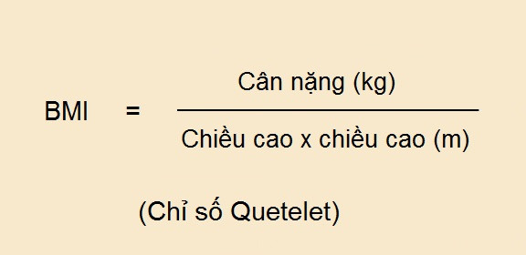
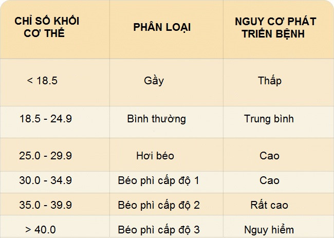
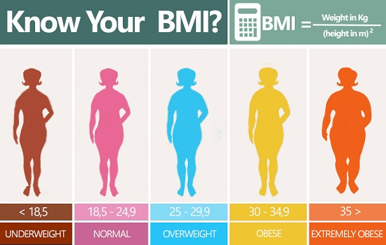
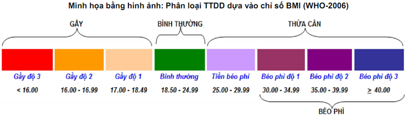
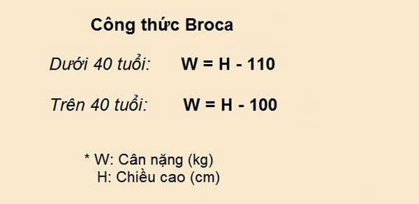

# a4_ex_flutter_app_bmi_calc

a4 practice make BMI calculator

Practice make a BMI calculator

## Build

### main_stateful_template.dart

Build a Stateful Widget template

## Reference

https://news.zing.vn/5-cong-thuc-don-gian-do-chi-so-bmi-post669580.html

## Images

## Getting Started

This project is a starting point for a Flutter application.

A few resources to get you started if this is your first Flutter project:

- [Lab: Write your first Flutter app](https://flutter.io/docs/get-started/codelab)
- [Cookbook: Useful Flutter samples](https://flutter.io/docs/cookbook)

For help getting started with Flutter, view our 
[online documentation](https://flutter.io/docs), which offers tutorials, 
samples, guidance on mobile development, and a full API reference.
