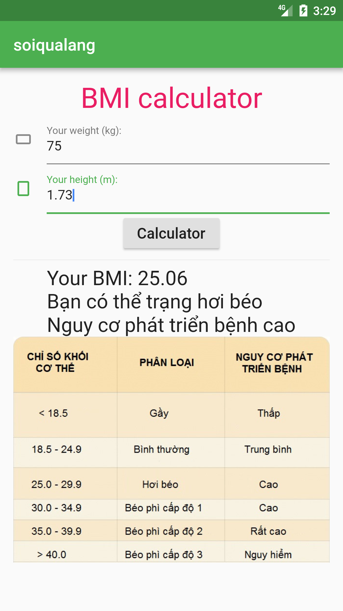
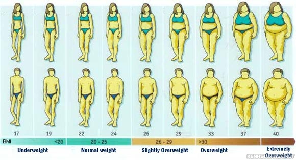

# a4_ex_flutter_app_bmi_calc

a4 practice make BMI calculator

Practice make a BMI calculator


## Build

### main_stateful_template.dart

Build a Stateful Widget template

## Finish



### v2

**Round number**

>num.round() returns an int AFAIK and there is no way to specify the number of fraction digits in double

https://github.com/dart-lang/sdk/issues/8575

and...

```
1.119.toStringAsFixed(2)

Results in 1.12.
```

**Config add image**

`pubspec.yaml`
```yaml
flutter:

  # The following line ensures that the Material Icons font is
  # included with your application, so that you can use the icons in
  # the material Icons class.
  uses-material-design: true

  # To add assets to your application, add an assets section, like this:
  assets:
   - assets/
  #  - images/a_dot_ham.jpeg
```

Tính add thêm hình ảnh, tuy nhiên gặp lỗi tràn kích thước


**Giải quyết lỗi tràn màn hình**

Thêm một `SingleChildScrollView`

```dart
Container container = new Container(
	padding: const EdgeInsets.all(16.0),
	child: new SingleChildScrollView(
	  child: new Column(
		children: <Widget>[
		  title,
		  txt_weight,
		  txt_height,
		  rbtn_calc,
		  Divider(),
		  txt_kq,
		  img_danhgia,
		],
	  ),
	)
);
```

* Add `bmi_des()` function for BMI details
* Style app


***

### v1


## Reference

https://news.zing.vn/5-cong-thuc-don-gian-do-chi-so-bmi-post669580.html

## Images





## Getting Started

This project is a starting point for a Flutter application.

A few resources to get you started if this is your first Flutter project:

- [Lab: Write your first Flutter app](https://flutter.io/docs/get-started/codelab)
- [Cookbook: Useful Flutter samples](https://flutter.io/docs/cookbook)

For help getting started with Flutter, view our 
[online documentation](https://flutter.io/docs), which offers tutorials, 
samples, guidance on mobile development, and a full API reference.
