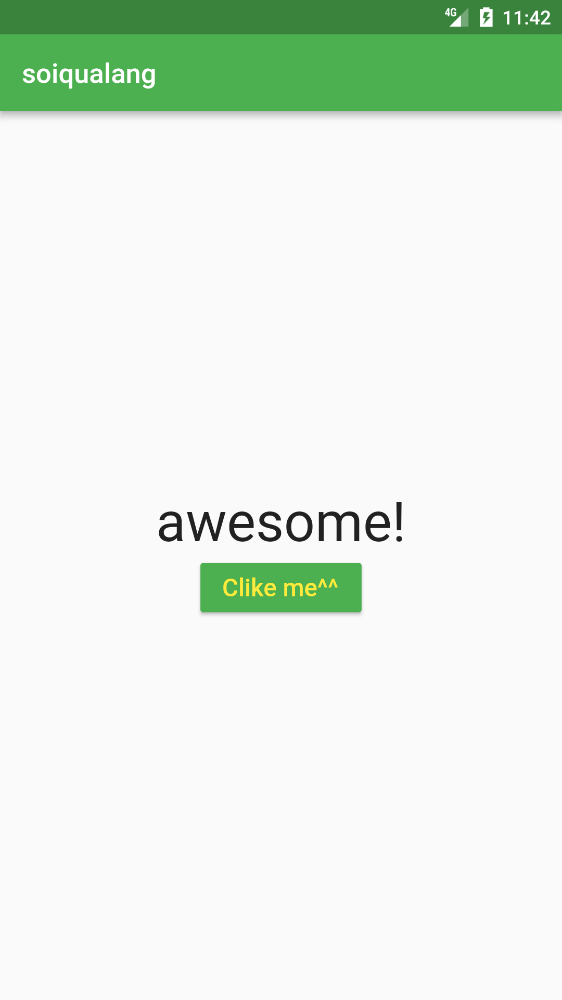

# a4_flutter_app_stateful

a4_flutter_app_stateful_widget



```dart
class mybtn extends StatefulWidget{
  @override
  mybtnState createState(){
    return new mybtnState();
  }
}

class mybtnState extends State<mybtn>{
  int counter=0;
  List<String> str=['Flutter', 'is', 'cool', "and","awesome!"];
  String display_str="Hello World!";

  void onpress_btn(){
    setState(() {
      display_str=str[counter];
      if(counter<str.length-1){
        counter=counter+1;
      }else{
        counter=0;
      }
    });
  }

  @override
  Widget build(BuildContext context) {
    //Make Text areas
    Text txt=new Text(display_str,style: new TextStyle(fontSize: 40),);
    //Make button
    RaisedButton rbtn=new RaisedButton(
      child: Text("Clike me^^",style: new TextStyle(color: Colors.yellow,fontSize: 18),),
      color: Colors.green,
      onPressed: onpress_btn,
    );

    Container container = new Container(
        padding: const EdgeInsets.all(16.0),
        child: new Center(
          child: new Column(
            mainAxisAlignment: MainAxisAlignment.center,
            children: <Widget>[
              txt,
              rbtn,
            ],
          ),
        )
    );
    AppBar appBar = new AppBar(title: new Text("soiqualang"));
    Scaffold scaffold = new Scaffold(
        appBar: appBar,
        body: container
    );
    return scaffold;
  }
}
```

## Getting Started

This project is a starting point for a Flutter application.

A few resources to get you started if this is your first Flutter project:

- [Lab: Write your first Flutter app](https://flutter.io/docs/get-started/codelab)
- [Cookbook: Useful Flutter samples](https://flutter.io/docs/cookbook)

For help getting started with Flutter, view our 
[online documentation](https://flutter.io/docs), which offers tutorials, 
samples, guidance on mobile development, and a full API reference.
