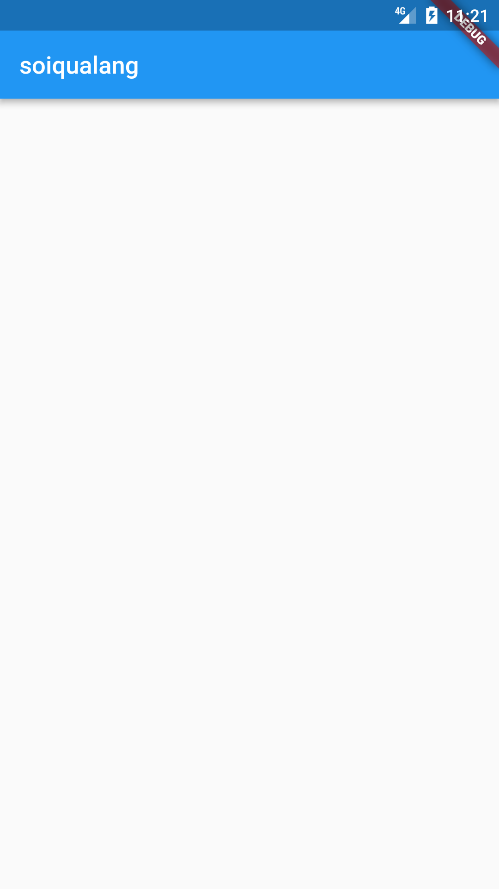
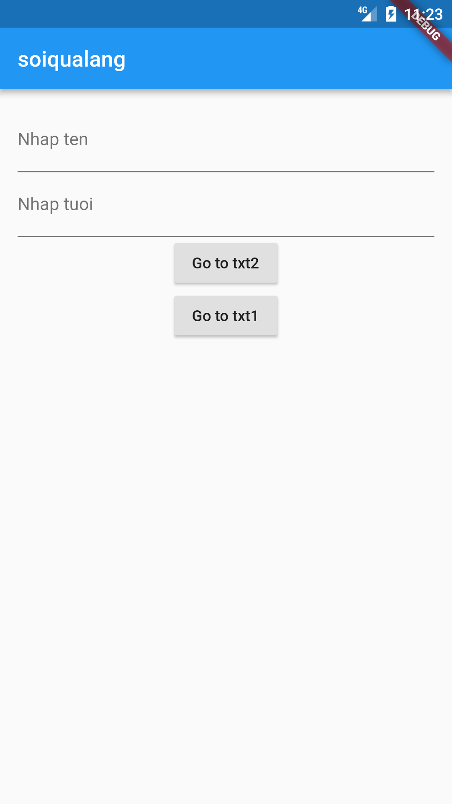
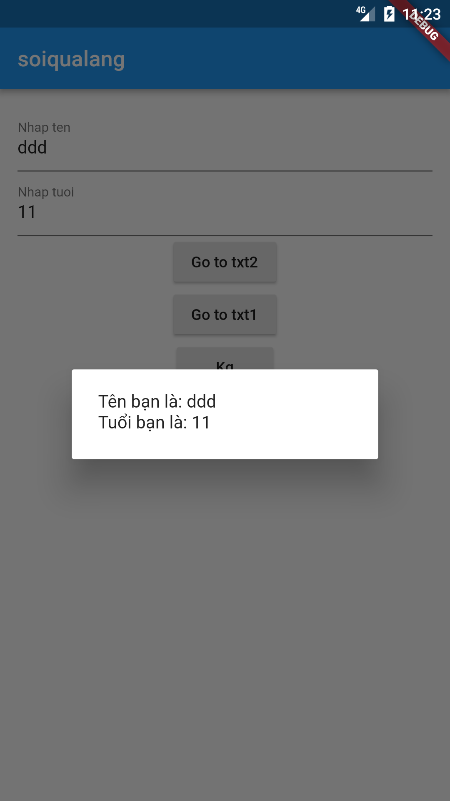
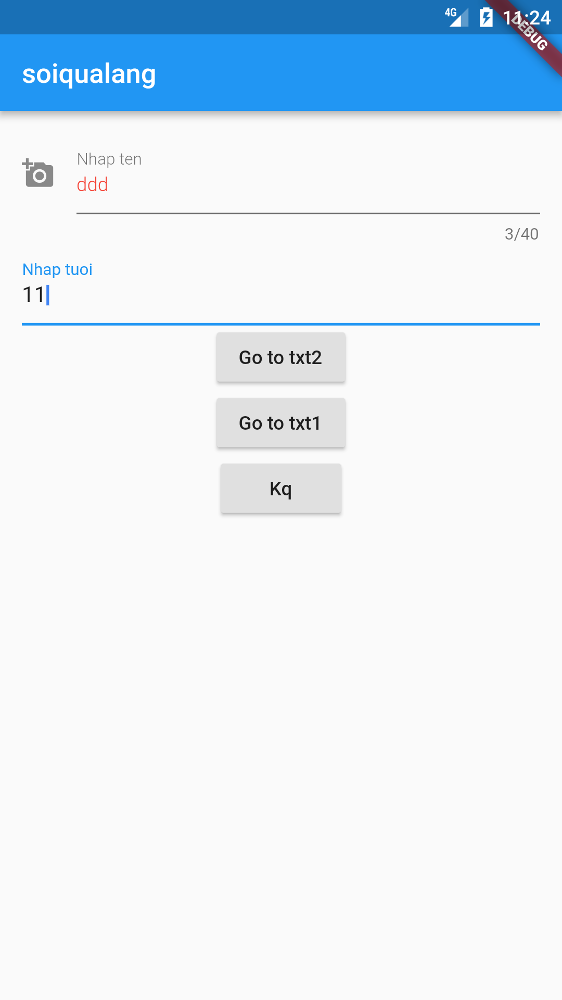
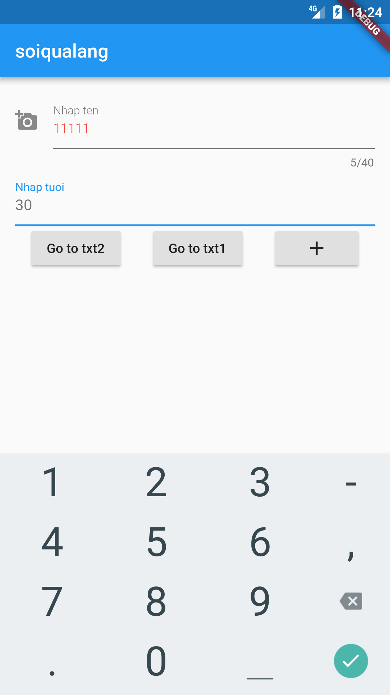
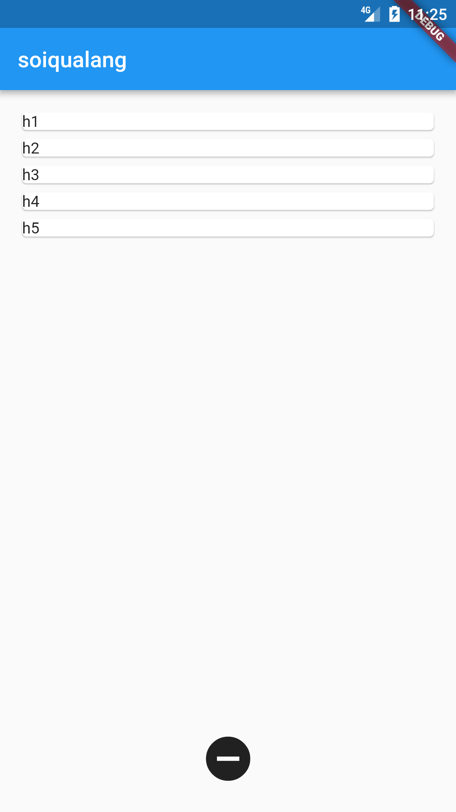
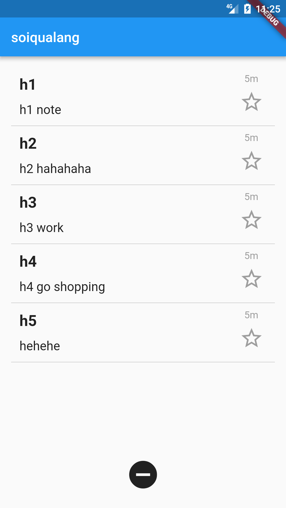

# flutter_app2

flutter_app2

***

**Truyền biến trong dart**
```dart
Text ditxt=new Text("Tên bạn là: $vtxt1 \n"
                      "Tuổi bạn là: $vtxt2");
```

Biến để ngoài `Widget build(BuildContext context)` sẽ không `hot reload`

## main_template1.dart

Tạo một app rỗng



## main_form.dart

Tạo textbox và button



## main_function.dart

Tạo function và gọi sự kiện `nhấn nút`



## main_style_txt.dart

Style textbox



## main_layout.dart

Layout



## main_listview.dart

Make list view form list



## main_listview_layout.dart

Make list view form list + layout listview



https://medium.com/flutter-community/a-deep-dive-into-flutter-textfields-f0e676aaab7a

## Getting Started

This project is a starting point for a Flutter application.

A few resources to get you started if this is your first Flutter project:

- [Lab: Write your first Flutter app](https://flutter.io/docs/get-started/codelab)
- [Cookbook: Useful Flutter samples](https://flutter.io/docs/cookbook)

For help getting started with Flutter, view our 
[online documentation](https://flutter.io/docs), which offers tutorials, 
samples, guidance on mobile development, and a full API reference.
